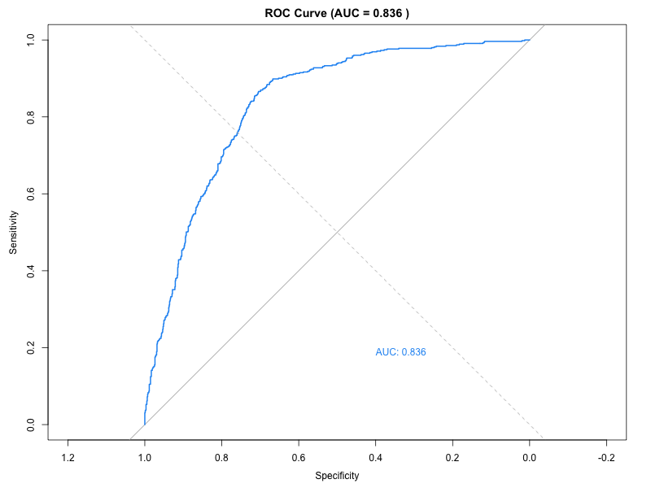
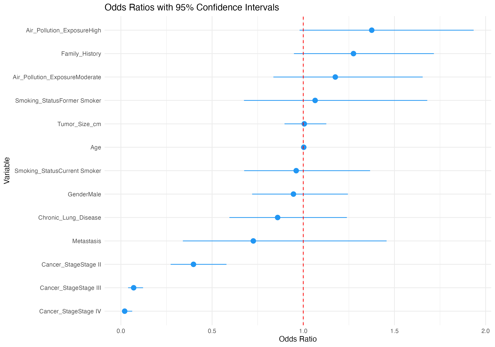
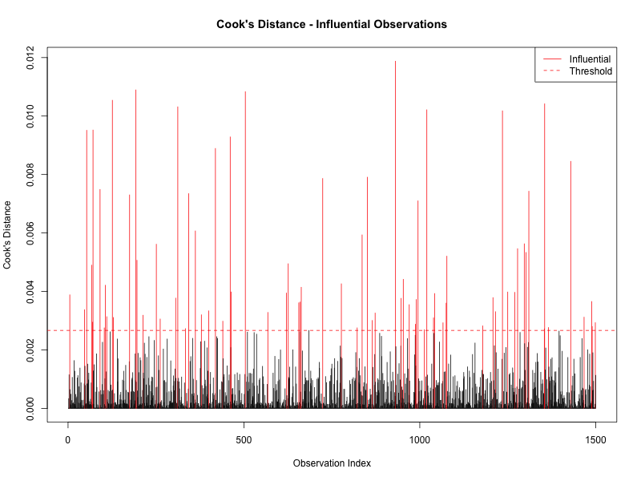

# Lung Cancer Logistic Regression

Logistic regression analysis predicting lung cancer survival outcomes 
using clinical and demographic factors in R.

## Dataset
- 1,500 patient records across 60 countries (2015–2025)
- 41 variables including demographics, risk factors, and treatment
- Source: [Kaggle - Lung Cancer Global Clinical Dataset](https://www.kaggle.com/datasets/zkskhurram/lung-cancer-global-clinical-risk-factor-dataset)

## Research Questions
1. Which clinical factors predict lung cancer survival?
2. What are the odds ratios for key risk factors?
3. How well does the model discriminate survivors from non-survivors?

## Key Findings
- **AUC = 0.836** — Good model discrimination
- Cancer stage is the strongest predictor of survival
- Interaction between cancer stage and metastasis was not significant (p = 0.53)
- 75 influential observations identified via Cook's Distance

## Scripts
Run in order:
- `01_data_prep.R` — data loading and recoding
- `02_logistic_model.R` — model fitting, odds ratios, confounder check
- `03_diagnostics.R` — VIF, Cook's Distance, Box-Tidwell test
- `04_model_evaluation.R` — ROC curve, AUC, odds ratio plot

## Requirements
```r
install.packages(c("dplyr", "ggplot2", "car", "pROC"))
```

## Key Figures

### ROC Curve


### Odds Ratio Plot


### Cook's Distance

## Results

Full model results including odds ratios, proportional hazards test, 
and model fit statistics are saved in:
- `results/logistic_model_summary.txt` — full model output
- `results/model_evaluation.txt` — AUC, AIC, McFadden R-squared
